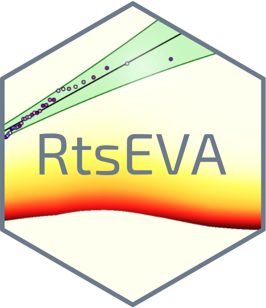

<!-- README.md is generated from README.Rmd. Please edit that file -->

```{r, include = FALSE}
knitr::opts_chunk$set(
  collapse = TRUE,
  comment = "#>",
  fig.path = "man/figures/README-",
  out.width = "100%"
)
```

# RtsEva

<!-- badges: start -->
[](https://github.com/Alowis/RtsEva/actions/workflows/R-CMD-check.yaml)
[]
[](https://cran.r-project.org/package=RtsEva)

<!-- badges: end -->



This package is an adaptation of the Matalb tsEVA toolbox developed by Lorenzo Mentaschi availaible here: https://github.com/menta78/tsEva

It contains an implementation of the Transformed-Stationary (TS) methodology for non-stationary EVA as described in Mentaschi et al. (2016). 
In synthesis this approach consists in (i) transforming a non-stationary time series into a stationary one to which the stationary EVA theory can be applied; 
and (ii) reverse-transforming the result into a non-stationary extreme value distribution.

## References ##
[Mentaschi, L., Vousdoukas, M., Voukouvalas, E., Sartini, L., Feyen, L., Besio, G., and Alfieri, L.: 
The transformed-stationary approach: a generic and simplified methodology for non-stationary extreme value analysis, Hydrol. Earth Syst. Sci., 20,3527-3547, 
doi:10.5194/hess-20-3527-2016, 2016](https://hess.copernicus.org/articles/20/3527/2016/)

## Installation

You can install the released version of RtsEva from

[CRAN](https://CRAN.R-project.org) with:

``` r
install.packages("RtsEva")
```

Alternatively, you can install the development version of RtsEva from [GitHub](https://github.com/) with:

``` r
# install.packages("devtools")
devtools::install_github("Alowis/RtsEva")
```

## Example

This is a basic example which shows you how to solve a common problem:

```{r, eval=FALSE}
library(RtsEva)
# Load a time series
timeAndSeries <- ArdecheStMartin
# go from six-hourly values to daily max
timeAndSeries <- max_daily_value(timeAndSeries)

# set a temporal window for the computation of running statistics
timeWindow <- 30*365 # 30 years

# Run the non-stationnary EVA
result <- TsEvaNs(timeAndSeries, timeWindow,
transfType = 'trendPeaks',tail = 'high')
```


After fitting the non-stationnay EVA, the package offers functions to 
visualize the plots.

Other resources are available for users to get a grasp of RtsEva and what can be done with it:

### Quarto document

A quarto document showing a step-by-step real world application of TSEVA for 
flood and drought analysis is available here: https://alowis.github.io/RTSEVA_guide/RtsEVA_demo.html

### Shiny demo app

A shiny app allowing the user to select different input timeseries and parameters: https://alowis.shinyapps.io/RtsEva_demo/


## Contact
For any questions or inquiries, please contact the package maintainer at alois.tilloy@ec.europa.eu


