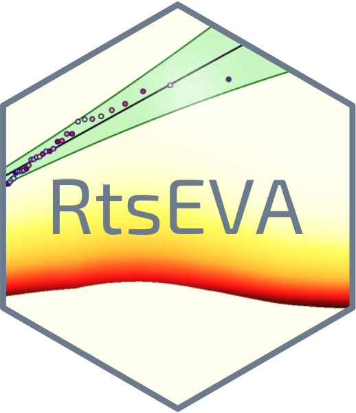

<!-- README.md is generated from README.Rmd. Please edit that file -->

# RtsEva

<!-- badges: start -->

[](https://github.com/Alowis/RtsEva/actions/workflows/R-CMD-check.yaml)
<!-- badges: end -->



This package is an adaptation of the Matalb tsEVA toolbox developed by
Lorenzo Mentaschi availaible here: <https://github.com/menta78/tsEva>

It contains an implementation of the Transformed-Stationary (TS)
methodology for non-stationary EVA as described in Mentaschi et
al. (2016). In synthesis this approach consists in (i) transforming a
non-stationary time series into a stationary one to which the stationary
EVA theory can be applied; and (ii) reverse-transforming the result into
a non-stationary extreme value distribution.

## References

[Mentaschi, L., Vousdoukas, M., Voukouvalas, E., Sartini, L., Feyen, L.,
Besio, G., and Alfieri, L.: The transformed-stationary approach: a
generic and simplified methodology for non-stationary extreme value
analysis, Hydrol. Earth Syst. Sci., 20,3527-3547,
doi:10.5194/hess-20-3527-2016,
2016](http://www.hydrol-earth-syst-sci.net/20/3527/2016/)

## Installation

You can install the development version of RtsEva from
[GitHub](https://github.com/) with:

``` r
# install.packages("devtools")
devtools::install_github("Alowis/RtsEva")
```

## Example

This is a basic example which shows you how to solve a common problem:

``` r
#library(RtsEva)
## basic example code
```

What is special about using `README.Rmd` instead of just `README.md`?
You can include R chunks like so:

``` r
summary(cars)
#>      speed           dist       
#>  Min.   : 4.0   Min.   :  2.00  
#>  1st Qu.:12.0   1st Qu.: 26.00  
#>  Median :15.0   Median : 36.00  
#>  Mean   :15.4   Mean   : 42.98  
#>  3rd Qu.:19.0   3rd Qu.: 56.00  
#>  Max.   :25.0   Max.   :120.00
```

You’ll still need to render `README.Rmd` regularly, to keep `README.md`
up-to-date. `devtools::build_readme()` is handy for this.

You can also embed plots, for example:


In that case, don’t forget to commit and push the resulting figure
files, so they display on GitHub and CRAN.
